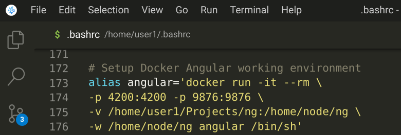

# docker-ng-dev

## Dockerize your Angular dev environment

VMs and containers have been [around for a while](https://blog.aquasec.com/a-brief-history-of-containers-from-1970s-chroot-to-docker-2016). They predate [Docker](https://www.docker.com/). There are other Docker [alternative projects](https://www.containiq.com/post/docker-alternatives). Most are [OCI compliant](https://opencontainers.org/) projects.

Early on [Linux](https://www.linuxfoundation.org/) got to have the foundational code pieces in namespace, cgroup, unionfs, and chroot to make VMs and containers possible. In Linux there is no need to use a VM to run Docker. [Docker Compose](https://docs.docker.com/compose/) is a tool for conveniently wiring together multi-container Docker applications using a YAML text file. [LXD](https://linuxcontainers.org/), [Kubernetes](https://kubernetes.io/), [Swarm](https://docs.docker.com/engine/swarm/), and etc. extend containers into nodes spanning multiple servers. This area in IT is a fast moving train that is quite fun to ride.

Docker is an application deployment technology. With Docker you can choose a pre-built image then copy your application into this image, including all the codes, libraries and dependencies that your application needs. In Docker you script, using a Dockerfile, the build process of your application image. A container is the running instance of the docker image. Checkout the [Docker documentation](https://docs.docker.com/). It is quite comprehensive.

I recommend <ins>***using only Docker Official Images***</ins> to keep away from malicious codes and vulnerabilities. You can also use images from companies you trust.

Docker is also an application development technology. These days it makes a lot of sense to install software dev tools into a Docker image. With experience you learn the pros and cons of using Docker in app dev.

The beauty of it is that when a new version of the tool comes out, you can use a variation of the steps below to use an image of this new version.

The way I prefer to use Docker for development purposes is to keep the image lean. To make it work takes 5 steps:
1. Git clone this project, then type ***cd docker-ng-dev/docker***
2. Build the image using the Dockerfile ***angular.dockerfile***
3. Create your main Angular project folder with ***mkdir -p ~/Projects/ng***
4. Add an alias entry in your ~/.bashrc file as shown belown
5. Reload your ~/.bashrc file with the command:   ***.   ~/.bashrc***

After step 5 you can run the alias command: ***angular***<br/>
You will now be in the Node-Angular container. To exit type ***exit***

The docker file ***docker/angular.dockerfile*** is fully commented:
```dockerfile
# angular.dockerfile
# Dockerize your Angular dev environment

# 1. After git cloning this project type: cd docker-ng-dev/docker
# 2. Build the Angular image using the command:
# docker build -f angular.dockerfile -t angular .

# 3. Create your main Angular project working folder.
# You can create project sub-folders in this Angular project folder.
# mkdir -p ~/Projects/ng

# 4. Add an alias in ~/.bashrc by adding the lines (remove #):
# alias angular='docker run -it --rm \
# -p 4200:4200 -p 9876:9876 \
# -v /home/$USER/Projects/ng:/home/node/ng \
# -w /home/node/ng angular /bin/sh'

# 5. Then reload ~/.bashrc by entering command: . ~/.bashrc

# After step 5 you can then run the alias command: angular
# You will now be in the Node-Angular container. To exit type: exit

FROM node:14.18-alpine
RUN npm install -g @angular/cli

```
<ins>***Note that in the following command examples the colon ":" is part of my command prompt.</ins>
<br/>
<ins>You DO NOT type the colon ":" as part of the command.***</ins>
<br/>
### 1. Git clone this project in a working folder
```
:git clone https://github.com/cydriclopez/docker-ng-dev.git
```

Or you can download and expand the [zip file](https://github.com/cydriclopez/docker-ng-dev/archive/refs/heads/main.zip). Then enter the command:
```
:cd docker-ng-dev/docker
```

### 2. Build the Angular image

Once inside the docker folder build the Angular image using the command:
```
:docker build -f angular.dockerfile -t angular .
```

Note that there is a "dot" or a period "." at the end of that command. That period "." gives the current folder as context for the docker command. It tells docker where to find the docker file ***angular.dockerfile***. Without the "-f" it looks for the default ***Dockerfile*** file. The "-t" names the docker image. So when we type the command "docker images" it lists the created image as "angular".
```
:docker images
REPOSITORY   TAG            IMAGE ID       CREATED        SIZE
angular      latest         809901e9120f   17 hours ago   170MB
postgres     latest         6a3c44872108   4 months ago   374MB
node         14.18-alpine   194cd0d85d8a   5 months ago   118MB
```
Note that the ***angular*** and ***node*** entries were added after the ***docker build*** command.

That ***postgres*** image entry is the subject of the next tutorial ***Dockerizing your Postgresql dev environment***.


### 3. Create your main Angular project folder

In this example the main Angular project folder is ***~/Projects/ng***
So we type:
```
:mkdir -p ~/Projects/ng
```
In this project folder you can have several subfolders to house your multiple Angular projects.
```
:pwd
/home/user1/Projects/ng
:ll
drwxr-xr-x 1 user1 user1   366 May 28 11:57 advert-primeng
drwx--x--x 1 user1 user1   228 Dec 12  2021 go-post-json-passthru
drwx--x--x 1 user1 user1   322 May 22 15:46 material-cart
drwxr-xr-x 1 user1 user1   366 Jun 23 22:12 treemodule-json
drwx--x--x 1 user1 user1   332 Aug 13  2021 ultima-try
```
### 4. Add an alias in ~/.bashrc by adding the following lines:
```bash
alias angular='docker run -it --rm \
-p 4200:4200 -p 9876:9876 \
-v /home/$USER/Projects/ng:/home/node/ng \
-w /home/node/ng angular /bin/sh'
```
This is a one-liner command that has been separated with the bash continuing character "\\" to make it easier to read. This alias command, with its parameters, can be clarified by the following table.

### Your host pc to Docker mappings table
|    | Your host pc | Docker |
| ----------- | --- | ----------- |
| ng serve port ( -p ) | 4200 | 4200 |
| ng test port ( -p ) | 9876 | 9876 |
| volume folder mapping ( -v ) | /home/$USER/Projects/ng | /home/node/ng |
| working folder ( -w ) | ( /home/$USER/Projects/ng ) | /home/node/ng |
| repository name |    | angular |
| executable in the repository |    | /bin/sh |

### Use your editor to add the alias command "angular"
Use your editor to edit your ***~/.bashrc*** file. In my case I enter the command:
```
:code ~/.bashrc
```
Then proceed to cut-and-paste the following lines into your editor:
```bash
alias angular='docker run -it --rm \
-p 4200:4200 -p 9876:9876 \
-v /home/$USER/Projects/ng:/home/node/ng \
-w /home/node/ng angular /bin/sh'
```
This is how it looks like in my case:<br/>


### 5. Reload your ~/.bashrc file

After you have inserted the alias command in your ***~/.bashrc*** file, you can reload it using the command:
```
:. ~/.bashrc
```
Remember, as I mentioned before, the colon ":" is part of the command line prompt. You do not type it. That command starts with a period "." followed by a space then ***~/bashrc***

After your ***~/.bashrc*** reloads, then the command ***angular*** will be available. Try enter this ***angular*** command.
```
:angular
/home/node/ng #
```
Note that the command-line prompt has changed. This signifies that you have left your localhost PC environment and are now inside the Node-Angular Docker container.

This ***angular*** command should now bring you inside the ***Node-Angular*** Docker container.

Right here you can now actually follow the Angular tutorial and [create the example project](https://angular.io/guide/setup-local#create-a-workspace-and-initial-application).

The only exception is that to serve your app use the command:
```
/home/node/ng # cd my-app
/home/node/ng/cd my-app # ng serve --host 0.0.0.0
```
Note that you added the ***--host 0.0.0.0*** parameter. This tells Angular to accept all incoming IP address. This is because your localhost PC has a different IP address as the Node-Angular Docker container.

_
